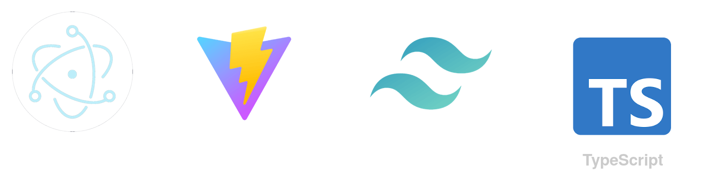

# Electron 12 + Vite 2 + Tailwind 2 + TypeScript - Starter

This Starter utilizes [Electron](https://electronjs.org/), [Vite](https://github.com/vitejs/vite), [Tailwind](https://tailwindcss.com/) and [TypeScript](https://typescriptlang.org) in combination. It trys to adhare the best practices mentioned in the [Talk by Kilian Valkhof](https://www.youtube.com/watch?v=fw4PmPaghyU)

## Installation

`make deps`

## Development

`make dev`

## Build

`make build`
